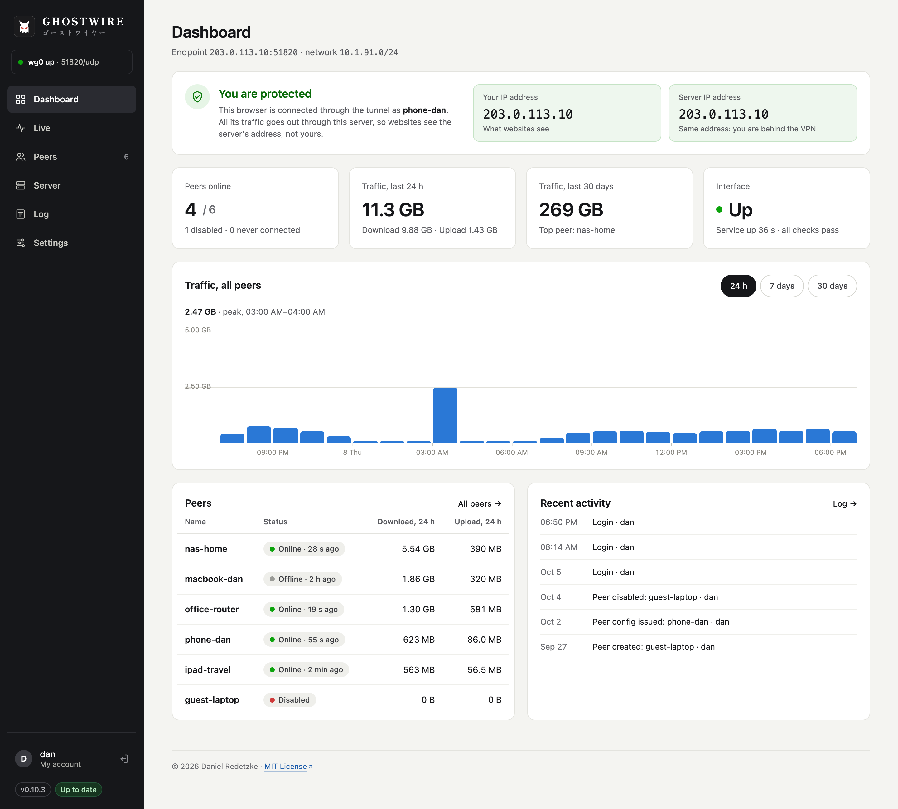
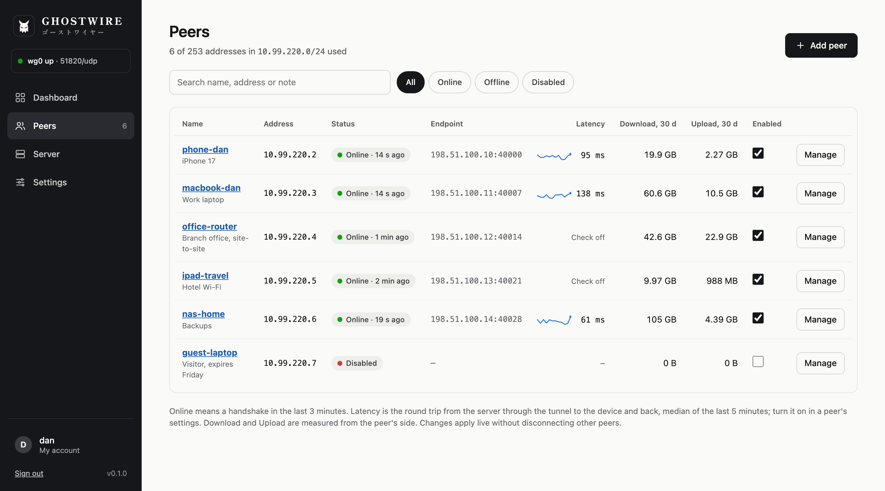
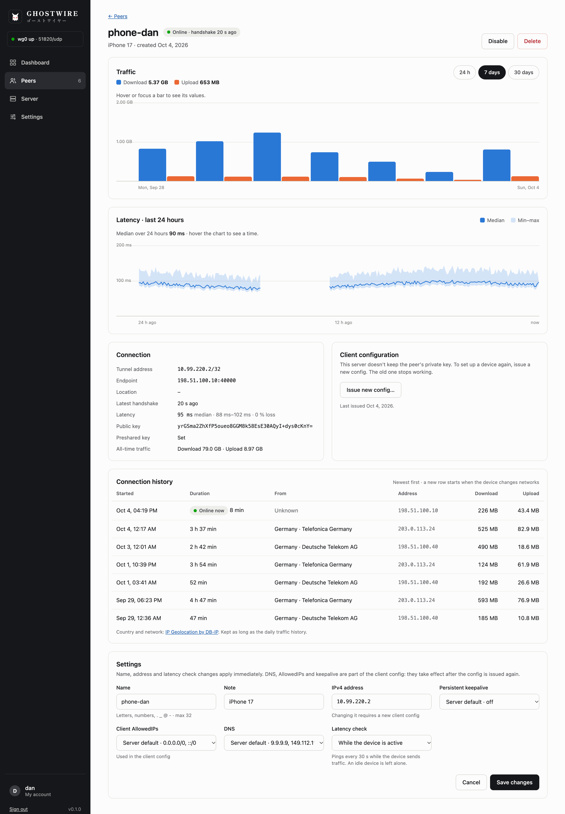
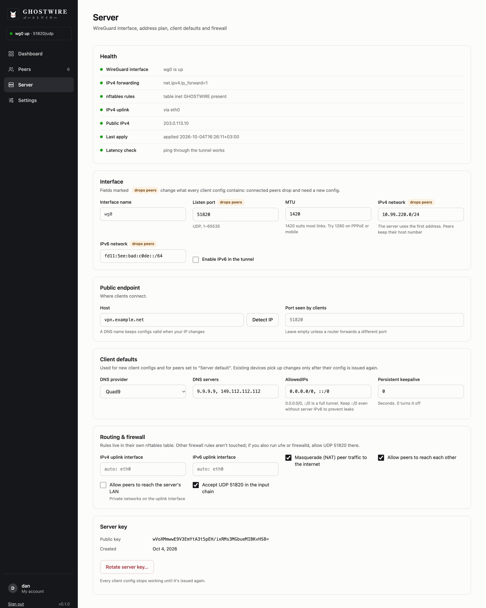
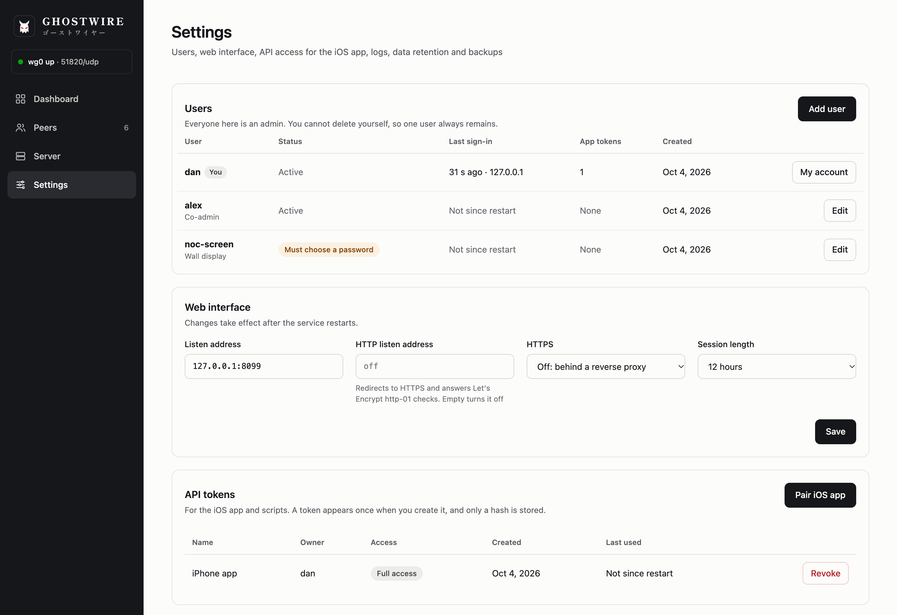
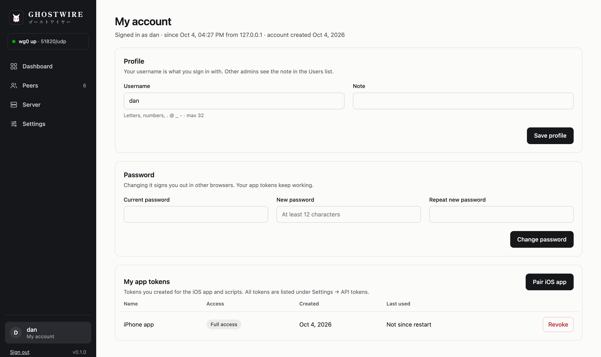
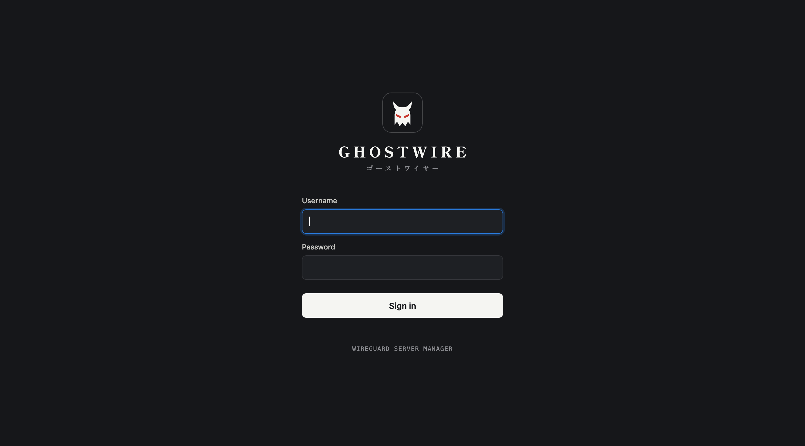

<p align="center">
  
</p>

# GHOSTWIRE

**ゴーストワイヤー** · A self-hosted WireGuard server manager in a single Go
binary, with a web interface, a JSON API and a native iPhone app.

GHOSTWIRE sets up the WireGuard server, manages peers (add, change, disable,
remove), hands out client configs as a download or QR code, and records traffic
and connection history per peer. There are no install scripts and no
dependencies on the server: the binary installs, updates and removes itself.



## Features

- **One file of state:** everything lives in `config.json`. The kernel is
  reconciled to it, so there is no `/etc/wireguard`, no `wg-quick` and no
  `wireguard-tools`.
- **Kernel access:** netlink creates `wg0` and sets its addresses and MTU;
  wgctrl sets keys and peers; nftables holds the rules in its own
  `inet GHOSTWIRE` table.
- **Live peer changes:** only peers that changed are touched, the same effect
  as `wg syncconf`, so connected peers stay connected.
- **IPv4 and IPv6:** IPv6 inside the tunnel is turned on automatically when the
  server has a global IPv6 address.
- **Traffic history:** kept in `stats.json`, hourly for 48 h and daily for
  400 days by default (Settings → Data retention).
- **Connection history:** every online session per peer, with start, duration,
  address and traffic. A new session starts when a device changes networks.
  Country and network operator come from the free
  [DB-IP Lite](https://db-ip.com) databases (CC BY 4.0). GHOSTWIRE downloads
  them monthly (about 20 MB) and looks addresses up locally, so peer addresses
  never leave the server. You can switch this off under Settings → Data
  retention.
- **Logs:** written to `GHOSTWIRE.jsonl`, rotated at 10 MB with 5 old files
  kept by default. Changes are marked as audit entries.
- **HTTPS built in:** Let's Encrypt, a self-signed certificate, your own
  certificate files, or plain HTTP behind a reverse proxy.

## Screenshots

| | |
|---|---|
|  |  |
| **Peers:** status, endpoint, latency and traffic at a glance | **Peer:** traffic, latency, connection history and settings |
|  |  |
| **Server:** health, address plan, client defaults and firewall | **Settings:** users, web interface and API tokens |
|  |  |
| **My account:** profile, password and your app tokens | **Sign-in** |

The screenshots show sample data from the built-in simulator.

## Security

- **Client private keys are never stored.** A config is shown once, as a
  download or QR code. "Issue new config" makes new keys.
- **Setup links:** instead of showing the QR code, you can send the device's
  owner a one-time link, valid for 1 hour, 24 hours or 7 days and protected by
  a 4-digit PIN by default. The keys are made only when the link is opened.
  The link works once, and 5 wrong PINs revoke it.
- **The service is not root.** It runs as user `ghostwire` with only
  `CAP_NET_ADMIN` and `CAP_NET_BIND_SERVICE`, and can write only to
  `/opt/ghostwire`.
- **Sign-in:** one or more users, all admins. Passwords are stored as argon2id hashes.
  After 5 failed attempts, sign-in is locked for 15 minutes. Sessions use an
  HttpOnly, SameSite=Strict cookie and last 12 hours by default.
- **Two-step sign-in:** each user can add an authenticator app (TOTP) and
  passkeys under My account. A passkey signs in on its own, without username
  and password, and also works as the second step after a password. It can live
  on the device (Touch ID, Face ID, Windows Hello), in a password manager, or on
  a YubiKey with a PIN set. Turning it on gives 10 one-time recovery codes. An
  admin can require it for everyone (Settings → Sign-in) and reset it for a user
  who lost their phone or key. Passkeys use WebAuthn and need the server's
  domain name with a trusted certificate (Let's Encrypt, certificate files, or a
  reverse proxy); on a self-signed certificate or an IP address, only the
  authenticator app is offered. API tokens never need a second step.
- **API tokens** are stored only as hashes and can be read-only or full access.
- `config.json` holds the server private key and is readable only by the
  service (0600).

## Requirements

- Linux with kernel 5.6 or newer (WireGuard built in), nftables and systemd
- Ports: UDP 51820 (WireGuard; another port can be chosen at install), TCP 443
  (web), TCP 80 (optional, Let's Encrypt http-01 and redirect)

## Build

Building needs Go 1.27 or newer. The binaries are static (no cgo), so they run
on any Linux distribution.

```sh
make linux-amd64      # dist/amd64/GHOSTWIRE
make linux-arm64      # dist/arm64/GHOSTWIRE (Raspberry Pi 64-bit, ARM servers)
make linux-arm        # dist/armv7/GHOSTWIRE (Raspberry Pi OS 32-bit)
make test
```

## Install

The binary installs itself. Copy it to the server and run it as root:

```sh
scp dist/amd64/GHOSTWIRE server:/tmp/
ssh server
sudo /tmp/GHOSTWIRE install
```

It asks a few questions, shows a summary and changes nothing until you
confirm:

```
Web interface
  Domain name for the web interface (empty: no domain, self-signed certificate)
  > vpn.example.net
  Email for Let's Encrypt expiry warnings (optional)
  > you@example.net

WireGuard
  Address devices connect to [vpn.example.net]
  >
  UDP port [51820]
  >

Admin account
  Password for "admin" (at least 12 characters): ************
  Repeat password: ************

Summary
  Web interface   https://vpn.example.net/ (Let's Encrypt, you@example.net)
  Endpoint        vpn.example.net:51820/udp
  Tunnel network  10.214.86.0/24 (random free range) · IPv6 on
  Firewall        443/tcp, 80/tcp, 51820/udp must be reachable

Install with these settings? [Y/n]
```

A domain turns on Let's Encrypt and is also the default WireGuard endpoint.
Without one, the web interface uses a self-signed certificate and the
endpoint defaults to the server's detected public IP.

### Unattended install

For scripts, cloud-init or Ansible, give the settings as flags. Questions
are skipped for every flag given, and entirely with `-y` or when there is no
terminal:

```sh
sudo /tmp/GHOSTWIRE install -y -domain vpn.example.net -email you@example.net -port 51820
```

| Flag | Default |
|---|---|
| `-domain` | none: self-signed certificate |
| `-email` | none |
| `-endpoint` | the domain |
| `-port` | 51820, or the current port when already installed |

The admin password is then read from standard input, e.g.
`echo "$PASSWORD" | sudo ./GHOSTWIRE install -y …`. Every value is checked
before anything is changed.

`install`:

1. creates the system user `ghostwire` and `/opt/ghostwire`
2. copies itself to `/opt/ghostwire/GHOSTWIRE`
3. creates `config.json` with defaults, if missing
4. writes `/etc/sysctl.d/99-ghostwire.conf` (IP forwarding) and
   `/etc/modules-load.d/ghostwire.conf`, and loads the kernel module
5. writes `/etc/systemd/system/ghostwire.service`
6. sets the admin password (first install only)
7. enables and starts the service, and checks that it stays up

Running it again is safe: steps that are already done are skipped, and the
questions offer the current settings, so Enter keeps them. If a changed
endpoint or port means existing devices need a new config, the summary says
how many.

Then open `https://vpn.example.net` and sign in as `admin`. Add more users
under Settings → Users. Root is needed only for the commands below, never for
the running service.

## Commands (as root)

| Command | What it does |
|---|---|
| `GHOSTWIRE install [-domain d] [-email e] [-endpoint h] [-port p] [-y]` | Sets up and starts the service, as above. Asks for the settings no flag gave; `-y` never asks. |
| `GHOSTWIRE update [-force]` | Run from the new binary, e.g. `sudo /tmp/GHOSTWIRE update`. Checks that it can read the current `config.json` (nothing changes if not), backs up the config to `config.json.bak-<old version>`, replaces the binary, updates the unit if needed and restarts. If the new version does not stay up, the old binary and config are put back and restarted. It refuses older versions without `-force`. |
| `GHOSTWIRE uninstall [-purge] [-y]` | Stops and removes the service, `wg0` and the firewall table. `-purge` also deletes `/opt/ghostwire` and the user. |
| `GHOSTWIRE passwd [username]` | Sets a user's password (default: the first user) and reloads the running service. The way back in if you are locked out. |
| `GHOSTWIRE version` | Prints the version. |

Updating restarts only the management service. VPN connections stay up,
because `wg0` lives in the kernel.

## config.json

A minimal file is enough. Missing values are filled with defaults on first
start: server key, a random free /24 subnet, port 51820, MTU 1420, Quad9 DNS,
full tunnel.

```json
{
  "web": {
    "listen": ":443",
    "httpListen": ":80",
    "tls": { "mode": "acme", "domain": "vpn.example.net", "email": "admin@example.net" }
  },
  "server": { "endpoint": "vpn.example.net" }
}
```

`web.tls.mode` can be:

| Mode | What it does |
|---|---|
| `acme` | Let's Encrypt, automatic. Uses tls-alpn-01 on :443, or http-01 when `httpListen` is set. Certificates are cached in `/opt/ghostwire/acme`. `"staging": true` uses the test CA. |
| `selfsigned` | Generates a certificate in `/opt/ghostwire/tls`. The iOS app pins its fingerprint. |
| `files` | Uses `certFile` and `keyFile`, and reloads them when they change. |
| `off` | Plain HTTP, for running behind a reverse proxy on localhost. |

After editing `config.json` by hand, run `sudo systemctl reload ghostwire`.

## Files in /opt/ghostwire

| File | Content |
|---|---|
| `GHOSTWIRE` | the program |
| `config.json` | all settings, server key, peers, token hashes (0600) |
| `stats.json` | traffic and connection history per peer |
| `geo-country.mmdb`, `geo-asn.mmdb` | DB-IP Lite databases for country and network lookups |
| `GHOSTWIRE.jsonl` | log, one JSON object per line. Changes carry `"audit":true` |
| `acme/`, `tls/` | certificates |

## API

Base path `/api/v1`. The web interface signs in with a session cookie; every
user is an admin. Apps and scripts use `Authorization: Bearer <token>`; create
the token under Settings → Pair iOS app. A token belongs to the user who made
it and is revoked when that user is deleted. A read-only token may only use
GET. Full-access tokens can do everything the web interface does except backup
and restore. Users, passwords and API tokens need a full-access token even for
reading.

For a user with two-step sign-in, `POST /auth/login` answers
`{"mfa": true, "ticket": "…", "methods": ["key", "totp", "recovery"]}`
instead of starting a session; the ticket is good for 5 minutes, and one of
the `/auth/login/…` steps turns it into the session. `PATCH /settings`
`{"signin": {"requireMfa": true}}` requires two-step sign-in for every user.

`POST /users` and `POST /users/{id}/reset-password` take
`{"password": "…", "mustChangePassword": true}`; with `true` (the default) the
user can do nothing but choose a new password at the next sign-in.

```
POST   /auth/login · /auth/logout        GET /auth/me        POST /auth/password (own password)
GET    /users      POST /users           PATCH /users/{id}   DELETE /users/{id}
POST   /users/{id}/reset-password    POST /users/{id}/reset-mfa
GET    /auth/options (public: is passkey sign-in offered here)
POST   /auth/login/totp · /auth/login/recovery {"ticket", "code"}
POST   /auth/login/key/begin {"ticket"} · /auth/login/key/finish?ticket=  (body: the WebAuthn credential)
POST   /auth/login/passkey/begin · /auth/login/passkey/finish?id=
signed in: GET /auth/mfa · POST /auth/mfa/totp/setup · /auth/mfa/totp/confirm · DELETE /auth/mfa/totp
signed in: POST /auth/mfa/keys/begin · /auth/mfa/keys/finish?name= · PATCH|DELETE /auth/mfa/keys/{id}
signed in: POST /auth/mfa/recovery-codes
GET    /status                           GET /stats?range=24h|7d|30d|90d
GET    /server         PATCH /server     POST /server/rotate-key     GET /server/detect-ip
GET    /peers          POST /peers       (returns the config and QR once)
GET    /peers/{id}     PATCH /peers/{id} DELETE /peers/{id}
POST   /peers/{id}/enable | /disable | /issue-config
GET    /peers/{id}/stats?range=…        GET /peers/{id}/sessions?limit=100
GET    /peers/{id}/latency               (24 h, one point per 5 minutes)
GET    /peers/{id}/setup (not read-only) DELETE /peers/{id}/setup
GET    /settings       PATCH /settings   POST /restart
GET    /logs?level=&limit=&audit=1       GET /logs/download
GET    /tokens     POST /tokens          DELETE /tokens/{id}
signed in: GET /backup · POST /restore
public: GET /setup/{token} · POST /setup/{token} {"pin"}   (what a setup link opens)
```

`POST /peers` and `POST /peers/{id}/issue-config` take
`{"delivery": "link", "linkHours": 1|24|168, "linkPIN": true}` to answer with a
setup link (`setup.url`, `setup.pin`, `setup.qr`) instead of a config. With a
link, the peer's current keys keep working until the link is opened.

Traffic is reported from the peer's point of view: `down` is what the peer
downloaded, `up` is what it uploaded.

Latency is measured by pinging the peer's tunnel address every 30 seconds. Set
it per peer with `PATCH /peers/{id}` `{"latencyCheck": "off"|"active"|"always"}`
(default `off`). `active` pings only while the device sends traffic, so idle
phones are not woken up; `always` keeps the tunnel up, so the peer always shows
as online. The service opens an unprivileged ICMP socket, which needs its group
in the sysctl `net.ipv4.ping_group_range` (systemd allows all groups by
default). Devices that block ping, such as Windows with its default firewall,
show no reply.

## Firewall note

GHOSTWIRE's rules sit in their own nftables table. An accept there cannot
override a drop in another table, so if ufw or firewalld is active, allow UDP
51820 (and TCP 443/80) in that firewall too.

## iOS app

The native iPhone app (SwiftUI, iOS 17+) lives in its own project,
GHOSTWIRE-Companion. It does everything the web interface does except
password, API tokens and backups. Pair it in the web interface under
Settings → Pair iOS app: scan the QR code, or tap "Copy pairing code" and paste
it into the app's "Enter manually". Self-signed certificates are pinned during
pairing.

## Development

On macOS (or any non-Linux system), `make dev` starts the app on
http://127.0.0.1:8080 with a traffic simulator in place of the kernel. Set a
password first:

```sh
make build && mkdir -p dev && ./GHOSTWIRE -config dev/config.json -passwd
```

## License

GHOSTWIRE is released under the [MIT License](LICENSE).

The wordmark typeface, Shippori Mincho B1 by the Shippori Mincho Project
Authors, is bundled as a subset under the
[SIL Open Font License 1.1](OFL-ShipporiMincho.txt).

The DB-IP Lite databases it downloads are by [DB-IP](https://db-ip.com) and
licensed under [CC BY 4.0](https://creativecommons.org/licenses/by/4.0/).
